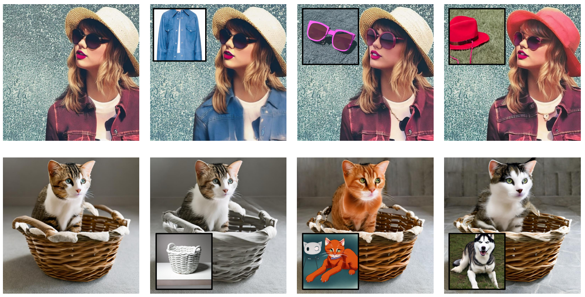
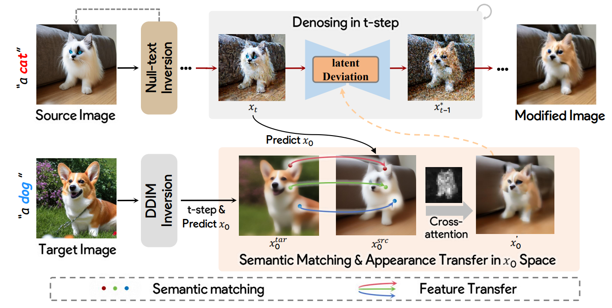

# Fine-grained Appearance Transfer with Diffusion Models

The *official* repository for Fine-grained Appearance Transfer with Diffusion Models.

## News
- 2023.11  Code will be released coming soon.

## Fine-grained Appearance Transfer

The results of fine-grained appearance transfer using our method. The leftmost column displays the source images. On the right, the output images achieved by detailed appearance transfer corresponding to the target images (outlined in black), while preserving structural integrity. The examples at the bottom demonstrate our method's capability to transfer across various domains and categories.

## Pipeline

 This figure illustrates our pipeline, commencing with null-text inversion applied to the source image \( I \), creating a latent path for reconstructing the image. During the diffusion denoising stage, Latent Deviation is performed, leading to a modified image that aligns with the target image \( T \). Specifically, the process begins with semantic alignment in the \( x_0 \) space between \( x_0^{\text{src}} \) and \( x_0^{\text{tar}} \), where \( x_0^{\text{tar}} \) is obtained through DDIM inversion with \( T \). Based on semantic relations, features from \( x_0^{\text{tar}} \) are transferred to \( x_0^{\text{src}} \), guided by an attention mask of \( I \), resulting in \( x'_0 \). Finally, \( x'_0 \) is processed in the latent space to synthesize the final modified image.